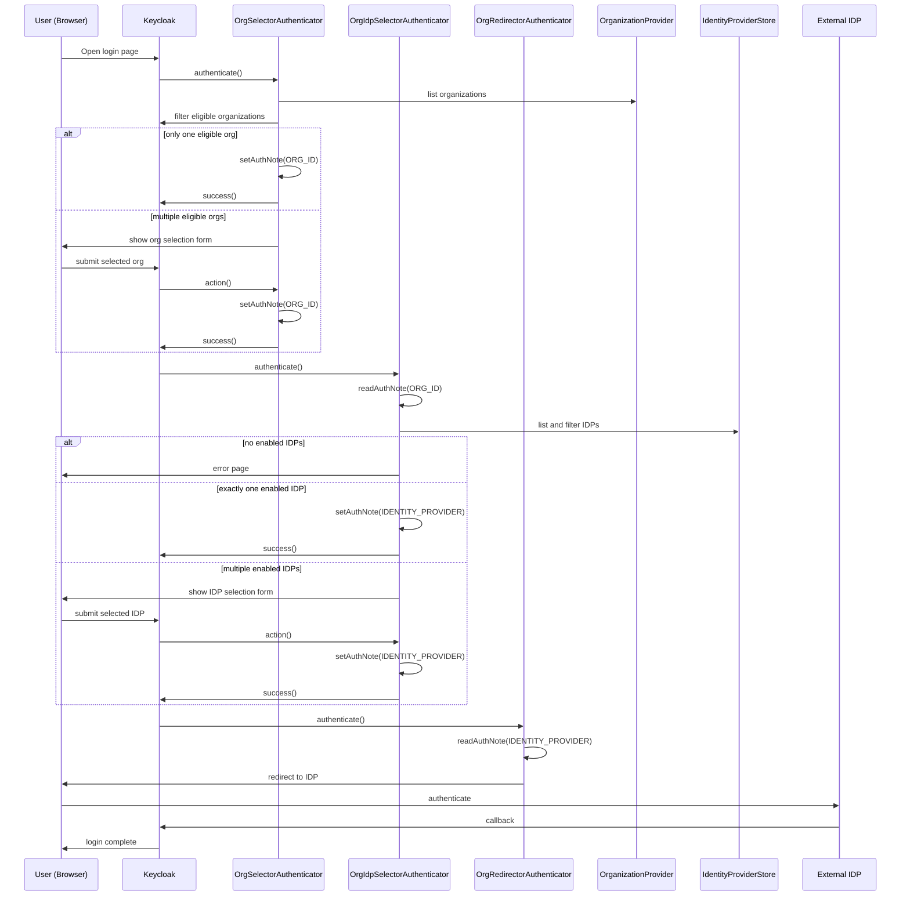

# Authentication Flow: flais-browser

This document describes the Keycloak Authentication Flow **flais-browser** (Default).

This flow is the entry point for browser-based login

## Flow type

-   **Type:** Browser Login
-   **Requirement:** Default
-   **Trigger:** User login via HTTP (Browser)

## Top-level executions

| Step / Subflow                      | Type           | Requirement | Notes                          |
| ----------------------------------- | -------------- | ----------- | ------------------------------ |
| Cookie                              | execution      | Alternative | Standard KC cookie SSO check   |
| flais-browser - Organization config | flow (subflow) | Alternative | Custom org/idp selection chain |

## Subflow: flais-browser - Organization config

Executions (in order):

| Step             | Requirement | Purpose                                                |
| ---------------- | ----------- | ------------------------------------------------------ |
| Org Selector     | Required    | Select eligible organization (auto-select if only one) |
| Org Idp Selector | Required    | Determine eligible IDPs for org (prompt if multiple)   |
| Org Redirector   | Required    | Redirect to chosen IDP alias                           |

## Execution sequence

The sequence diagram below illustrates how Keycloak executes
the `flais-browser` authentication flow using custom authenticators.

It reflects the execution order configured in the Keycloak Admin UI.

