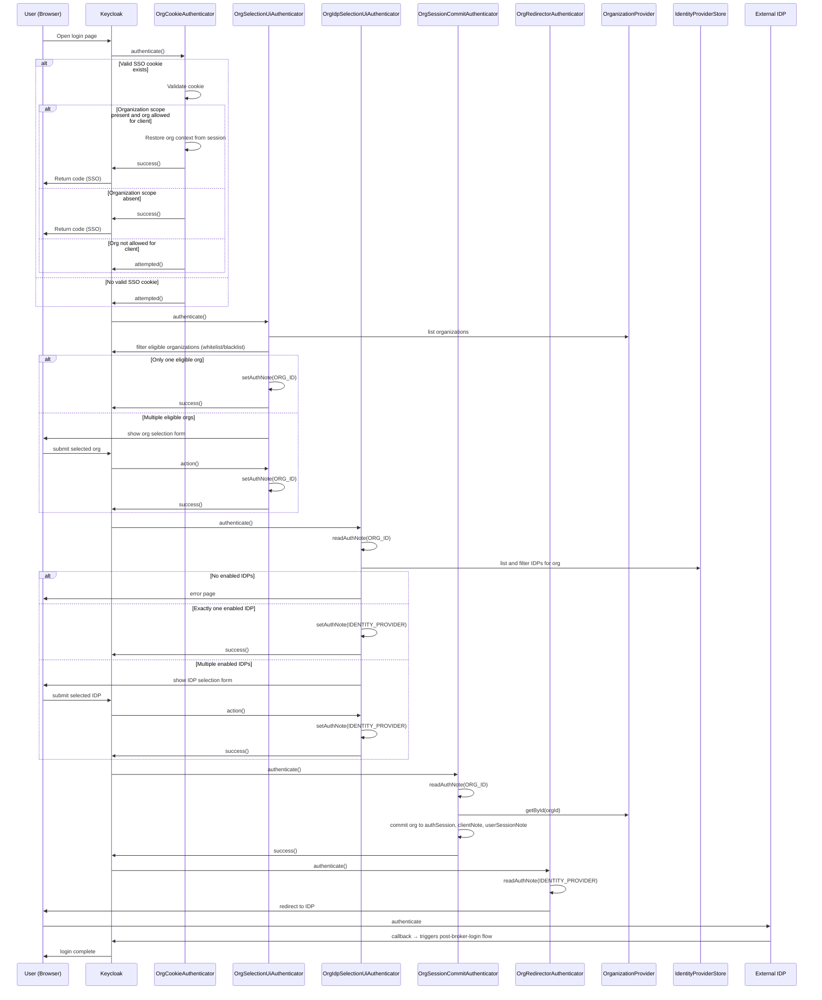

# Authentication Flow: flais-browser

This document describes the Keycloak Authentication Flow **flais-browser**.

This flow is the entry point for browser-based login.

## Flow type

- **Type:** Browser Login
- **Trigger:** User login via HTTP (Browser)

## Top-level executions

| Step / Subflow                      | Type           | Requirement | Notes                                      |
| ----------------------------------- | -------------- | ----------- | ------------------------------------------ |
| FLAIS Organization SSO Cookie       | execution      | Alternative | Custom SSO cookie check with org awareness |
| flais-browser - Organization config | flow (subflow) | Alternative | Custom org/idp selection chain             |

## Subflow: flais-browser - Organization config

Executions (in order):

| Step                                            | Requirement | Purpose                                                        |
| ----------------------------------------------- | ----------- | -------------------------------------------------------------- |
| FLAIS Organization Selection                    | Required    | Select eligible organization (auto-select if only one)         |
| FLAIS Organization Identity Provider Selection  | Required    | Determine eligible IDPs for org (prompt if multiple)           |
| FLAIS Organization Session Commit               | Required    | Commit selected org into session, auth notes, and client notes |
| FLAIS Organization Identity Provider Redirector | Required    | Redirect to chosen IDP                                         |

## Execution sequence

The sequence diagram below illustrates how Keycloak executes
the `flais-browser` authentication flow using custom authenticators.

```mermaid
sequenceDiagram
  participant U as User (Browser)
  participant KC as Keycloak
  participant OCA as OrgCookieAuthenticator
  participant OS as OrgSelectionUiAuthenticator
  participant OIP as OrgIdpSelectionUiAuthenticator
  participant OSC as OrgSessionCommitAuthenticator
  participant OR as OrgRedirectorAuthenticator
  participant OP as OrganizationProvider
  participant IDPS as IdentityProviderStore
  participant IDP as External IDP

  U->>KC: Open login page
  KC->>OCA: authenticate()

  alt Valid SSO cookie exists
    OCA->>OCA: Validate cookie
    alt Organization scope present and org allowed for client
      OCA->>OCA: Restore org context from session
      OCA->>KC: success()
      KC->>U: Return code (SSO)
    else Organization scope absent
      OCA->>KC: success()
      KC->>U: Return code (SSO)
    else Org not allowed for client
      OCA->>KC: attempted()
    end
  else No valid SSO cookie
    OCA->>KC: attempted()
  end

  KC->>OS: authenticate()
  OS->>OP: list organizations
  OS->>KC: filter eligible organizations (whitelist/blacklist)

  alt Only one eligible org
    OS->>OS: setAuthNote(ORG_ID)
    OS->>KC: success()
  else Multiple eligible orgs
    OS->>U: show org selection form
    U->>KC: submit selected org
    KC->>OS: action()
    OS->>OS: setAuthNote(ORG_ID)
    OS->>KC: success()
  end

  KC->>OIP: authenticate()
  OIP->>OIP: readAuthNote(ORG_ID)
  OIP->>IDPS: list and filter IDPs for org

  alt No enabled IDPs
    OIP->>U: error page
  else Exactly one enabled IDP
    OIP->>OIP: setAuthNote(IDENTITY_PROVIDER)
    OIP->>KC: success()
  else Multiple enabled IDPs
    OIP->>U: show IDP selection form
    U->>KC: submit selected IDP
    KC->>OIP: action()
    OIP->>OIP: setAuthNote(IDENTITY_PROVIDER)
    OIP->>KC: success()
  end

  KC->>OSC: authenticate()
  OSC->>OSC: readAuthNote(ORG_ID)
  OSC->>OP: getById(orgId)
  OSC->>OSC: commit org to authSession, clientNote, userSessionNote
  OSC->>KC: success()

  KC->>OR: authenticate()
  OR->>OR: readAuthNote(IDENTITY_PROVIDER)
  OR->>U: redirect to IDP
  U->>IDP: authenticate
  IDP->>KC: callback → triggers post-broker-login flow
  KC->>U: login complete
```
