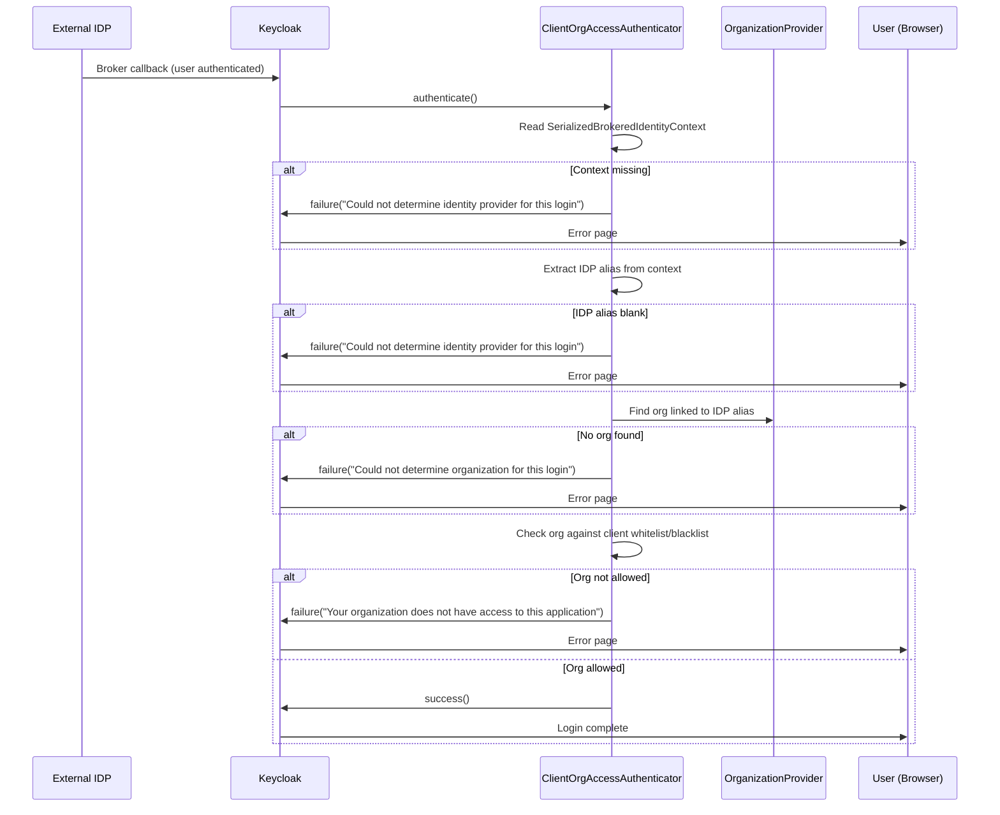

# Authentication Flow: flais-post-login-flow

This document describes the Keycloak Authentication Flow **flais-post-login-flow**.

This flow runs after a user has successfully authenticated with an external IDP
(post-broker-login). It enforces that the IDP the user actually authenticated
through belongs to an organisation that is permitted to access the requesting client.

## Flow type

- **Type:** Post Broker Login
- **Trigger:** Automatically after every successful external IDP authentication

## Why this flow exists

Without this flow, an attacker who initiates a login for client A (whose org is
bound to IDP `entra-X`) could intercept the browser redirect to
`/broker/entra-X/login` and swap the IDP alias to `entra-Y`. They would then
authenticate successfully via the other org's IDP and receive a token for
client A — despite never belonging to the correct organisation.

This flow closes that gap by running server-side validation after the broker
callback, regardless of which IDP was used.

## Top-level executions

| Step                             | Requirement | Purpose                                          |
| -------------------------------- | ----------- | ------------------------------------------------ |
| FLAIS Organization Client Access | Required    | Verify IDP org is allowed for the current client |

## Authenticator: ClientOrgAccessAuthenticator

The authenticator performs the following steps:

1. Reads the `SerializedBrokeredIdentityContext` from the authentication session
2. Extracts the IDP alias that was actually used
3. Resolves the organisation linked to that IDP via `OrganizationProvider`
4. Checks the resolved organisation against the client's `permission.whitelisted.organizations`
   and `permission.blacklisted.organizations` attributes
5. Calls `context.success()` if access is granted, or `context.failure(...)` with
   an error message if denied

## Access denied conditions

| Condition                                  | Error message                                                |
| ------------------------------------------ | ------------------------------------------------------------ |
| No brokered identity context in session    | `Could not determine identity provider for this login`       |
| IDP alias is missing or blank              | `Could not determine identity provider for this login`       |
| No organisation linked to the IDP          | `Could not determine organization for this login`            |
| Organisation is not allowed for the client | `Your organization does not have access to this application` |

## Execution sequence

