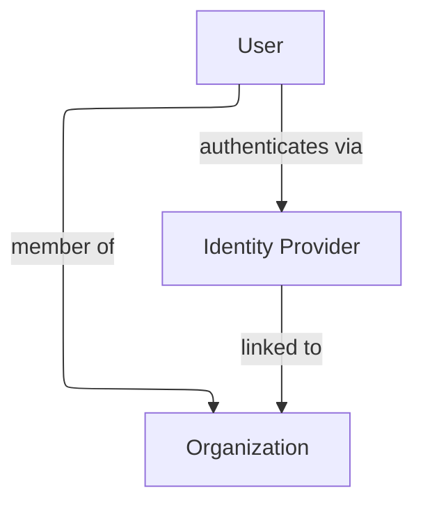

# Identity Providers (IDPs)

## What is an IDP?

An identity provider is an external system used for authentication
(e.g. Azure AD, BankID).

## Organization linkage

IDPs are linked to organizations and to users.

## Authentication model

-   User selects organization
-   Organization determines available IDPs
-   User authenticates via selected IDP

## Diagram

