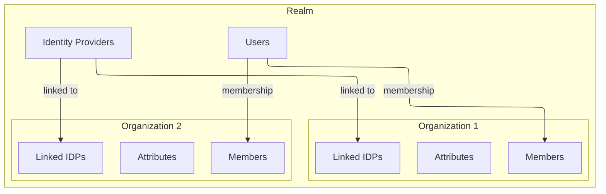

# Organizations

## What is an organization?

An organization represents a tenant within a realm. Each realm has its own set of organizations.

## Responsibilities

-   Group users
-   Hold tenant-specific attributes
-   Define which IDPs are available
-   Linked domains

## Multi-tenancy

Multi-tenancy is implemented using organizations inside a realm,
not by creating multiple realms.

## Relationships

-   Realm → many organizations
-   Organization → many members
-   Organization → many IDPs
-   Organization → many domains
-   Organization → many attributes

## Diagram

