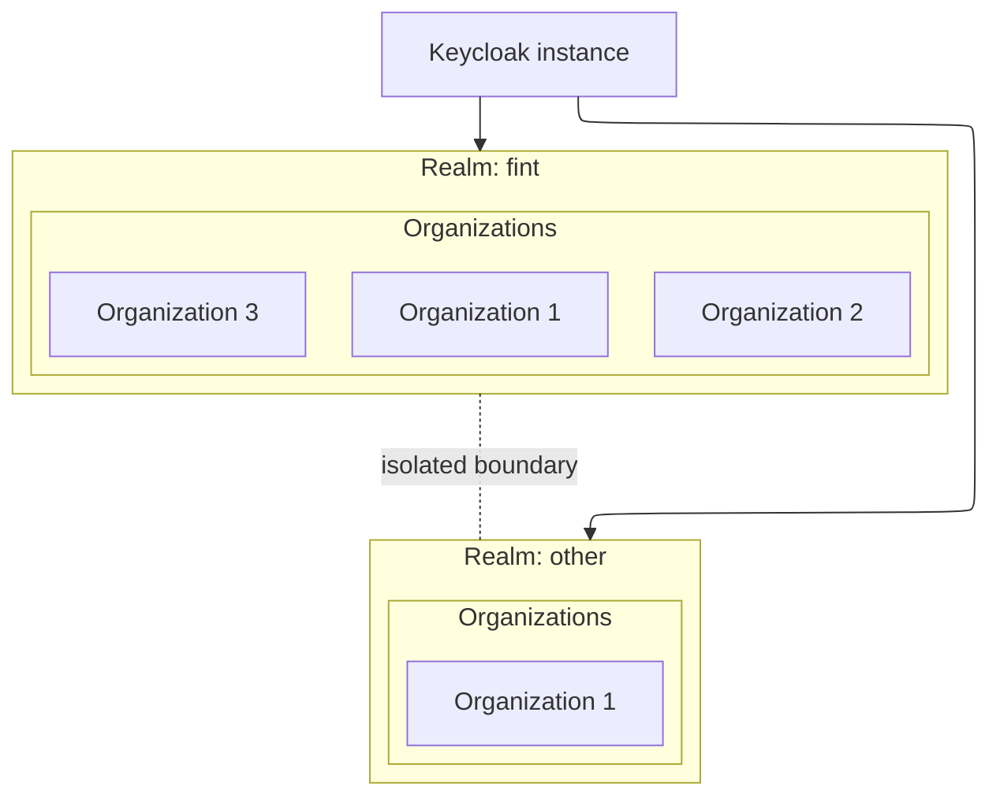

# Realms

## What is a realm?

A realm is an isolated instance boundary in Keycloak.
Resources in one realm do not conflict with or access resources in another.

## Master realm

Keycloak ships with a built-in `master` realm used for administration.
This realm should remain clean and not be used for applications.

## Realm per project/service

Each service or project is assigned its own realm.

Examples:

- `fint`
- `flais`

## Organizations

One realm can have multiple organizations. We are using organizations to support multi-tenancy.

## Diagram

