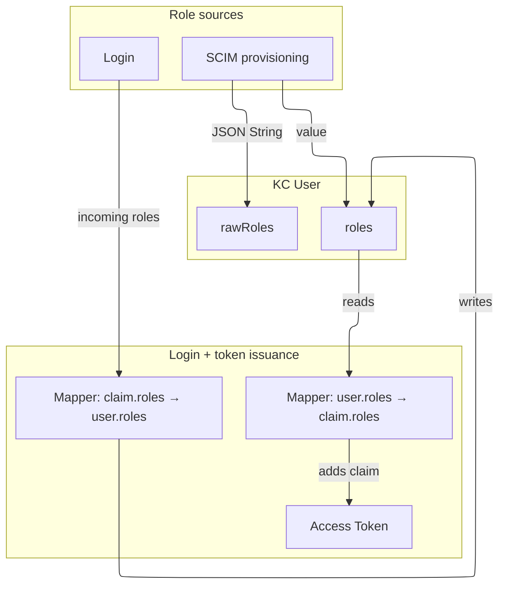

# Roles

## Design choice

Roles are implemented as user attributes instead of native Keycloak roles and gives:

-   Integration with external role sources
-   Flexible role formats
-   Consistent internal representation
-   Flexibility with SCIM implementation

## User attributes

-   `rawRoles` – original role payload (JSON string)
-   `roles` – normalized role values

## Role sources

-   SCIM provisioning
-   Login token claims

## Diagram

