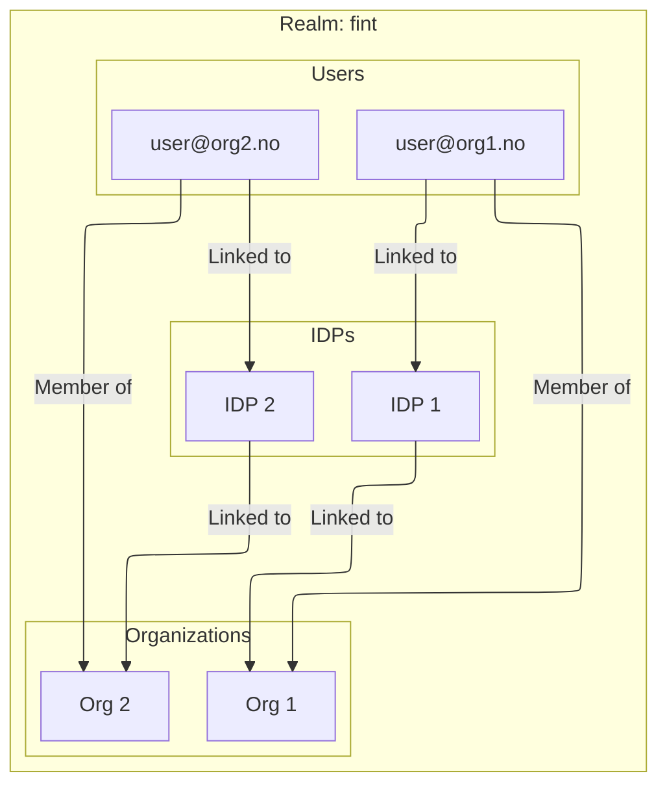

# Users

## What is a user?

A user represents a single identity within a realm.

## Restrictions

-   A user belongs to exactly one organization
-   User identifier must be unique within a realm
-   User can only have one domain

## Identity providers

-   A user may have linked multiple IDPs
-   All linked IDPs must belong to the users organization

## Diagram

