# Federering av brukere – Keycloak

Denne veiledningen beskriver hvordan federeringsløsningen mellom Microsoft Entra ID og Keycloak fungerer, og hvordan tilganger administreres.

## Terminologi

I denne veiledningen brukes betegnelsen **federeringsapplikasjonen** om Enterprise Application i Microsoft Entra ID som er koblet til Keycloak-løsningen. Applikasjonens faktiske visningsnavn i Entra ID kan variere avhengig av fylkeskommunens navnekonvensjoner.

På Keycloak-siden er federeringen konfigurert i realmet med det tekniske navnet `fint`. Navnet kan forekomme i adresser, konfigurasjon, logger og feilmeldinger. Når denne veiledningen omtaler realmet `fint`, menes dette avgrensede området i Keycloak.

Det tekniske førstegangsoppsettet utføres ved hjelp av oppsettverktøyet fra Novari. Se [`dokumentasjon`](../../../../../powershell/fint/README.md) for mer informasjon.

## Arkitektur

Applikasjonene kobles til Keycloak og bruker Keycloak som felles inngangspunkt for innlogging. Keycloak styrer innloggingsflyten og videresender brukeren til riktig identitetsleverandør. For fylkeskommunens brukere er Microsoft Entra ID konfigurert som en ekstern Identity Provider i Keycloak.

I Entra ID består integrasjonen av to separate, men tilknyttede objekter:

- **App Registration** inneholder den tekniske OIDC-konfigurasjonen som Keycloak bruker mot Entra ID, blant annet klient-ID, redirect URI, klienthemmelighet, tokenkonfigurasjon og definisjoner av applikasjonsroller.
- **Enterprise Application** er integrasjonens service principal i Entra ID. Den brukes til bruker- og gruppetildelinger, rolletildelinger, tilgangskontroll og SCIM-provisjonering.

Integrasjonen har to separate dataflyter:

- **Innlogging med OIDC:** Applikasjonen sender brukeren til Keycloak. Keycloak bruker Entra ID som Identity Provider og videresender brukeren dit for autentisering. Etter autentisering returnerer Entra ID brukeren til Keycloak. Keycloak behandler identiteten og fullfører innloggingen mot applikasjonen.
- **Provisjonering med SCIM:** Entra-provisjoneringen som er konfigurert på Enterprise Application, oppretter og oppdaterer brukere i Keycloak. Avhengig av endringen kan brukere også deaktiveres eller slettes. Nødvendige brukerattributter og tildelte applikasjonsroller overføres i samme flyt.

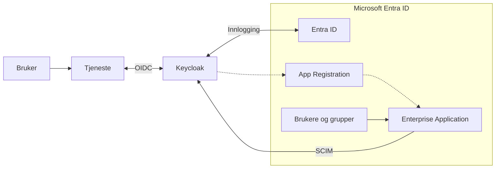

> [!NOTE]
> Innlogging og provisjonering er uavhengige prosesser. En vellykket innlogging betyr derfor ikke nødvendigvis at en SCIM-endring er ferdig behandlet.

## Brukerattributter

For at en bruker skal få riktig identitet i Keycloak, må nødvendige attributter være tilgjengelige i Entra ID.

Hvilke extension-attributter som benyttes, bestemmes under førstegangsoppsettet. Fylkeskommunen drifter valget og sørger for at de samme attributtene benyttes i hele flyten. Dette kan endres på et senere tidspunkt om nødvendig.

Ved innlogging sendes relevante claims i OIDC-tokenet. Ved provisjonering overføres brukerdata gjennom SCIM. SCIM-data behandles som autoritative. Endringer skal derfor gjøres på brukeren i Entra ID, ikke direkte i Keycloak. Verdier som endres manuelt i Keycloak, kan bli overskrevet ved neste provisjonering eller innlogging.

## Applikasjonsroller

Applikasjonsrollene defineres i App Registration. Tilgang tildeles ved å koble brukere eller grupper til rollene gjennom Enterprise Application.

Rollene opprettes som en del av det tekniske oppsettet og følger [rollekatalogen](https://role-catalog.vigoiks.no/).

Rollens verdi må ikke endres manuelt. Roller skal konfigureres ved hjelp av PowerShell-skriptet. Se [`dokumentasjon`](../../../../../powershell/fint/README.md) for mer informasjon.

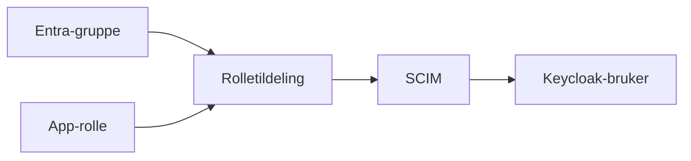

> [!NOTE]
> Gruppene brukes til å styre hvilke brukere og roller som skal provisjoneres. Selve gruppeobjektene opprettes ikke i Keycloak.

## Rolletildeling

Tilgang tildeles ved å koble en Entra ID-gruppe (eller bruker direkte) til en applikasjonsrolle i federeringsapplikasjonen.

1. Logg inn i [Microsoft Entra administrasjonssenter](https://entra.microsoft.com/).
2. Gå til **Identity** → **Applications** → **Enterprise applications**.

   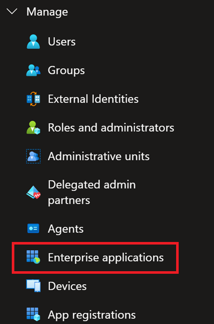

3. Søk etter og åpne **federeringsapplikasjonen**. Bruk visningsnavnet som ble valgt under førstegangsoppsettet.
4. Klikk **Users and groups**.

   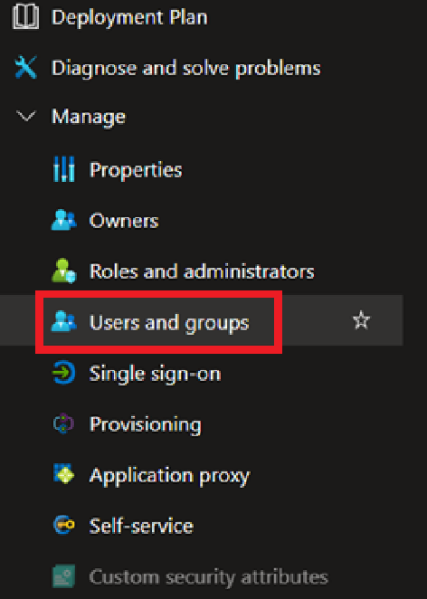

5. Klikk **Add user/group**.

   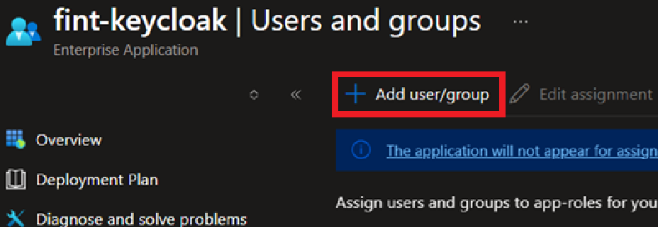

6. Klikk **None selected** under **Users and groups**.

   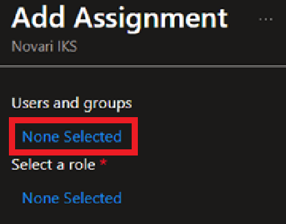

7. Søk etter og velg gruppen som skal få tilgang.
8. Klikk **Select**.

    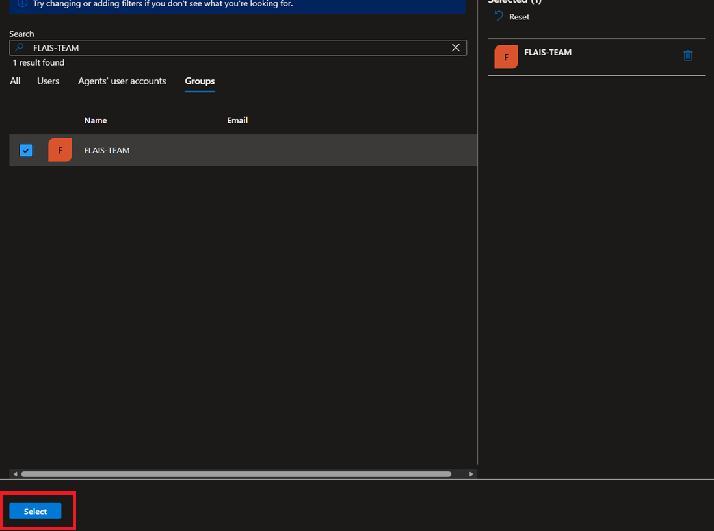

9. Klikk **None selected** under **Select a role**.

    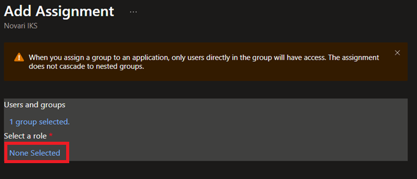

10. Velg rollen gruppen skal ha.
11. Klikk **Select**.

    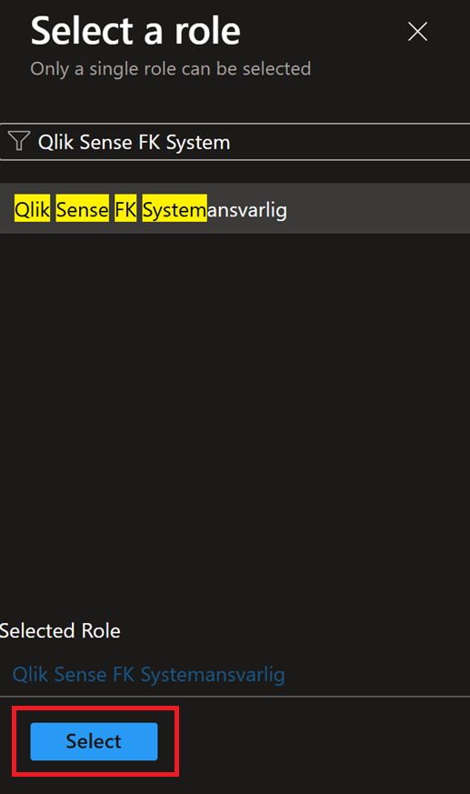

12. Kontroller at riktig gruppe og rolle er valgt.
13. Klikk **Assign**.

    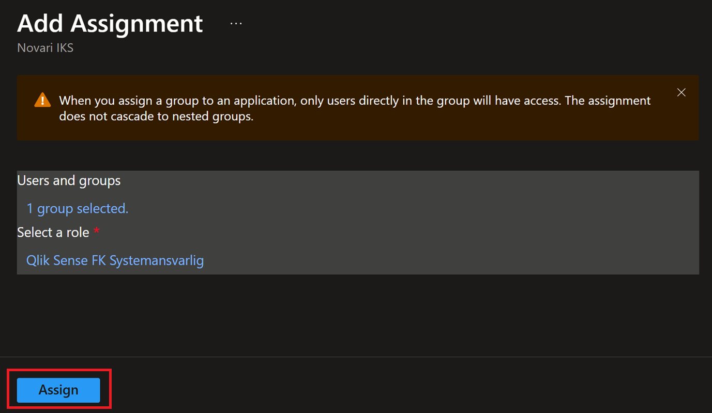

Gruppen vises nå i oversikten **Users and groups** med den tilknyttede rollen.

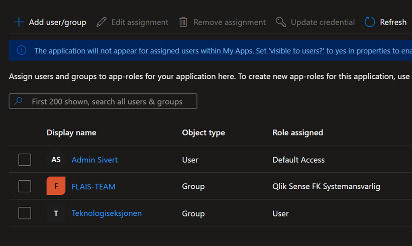

En gruppe kan tildeles flere applikasjonsroller ved å opprette én tildeling per rolle. En bruker som er medlem av flere tildelte grupper, kan derfor motta flere roller.

Medlemmene av gruppen blir provisjonert til Keycloak med den valgte rollen. Det kan ta noe tid før endringen er behandlet.

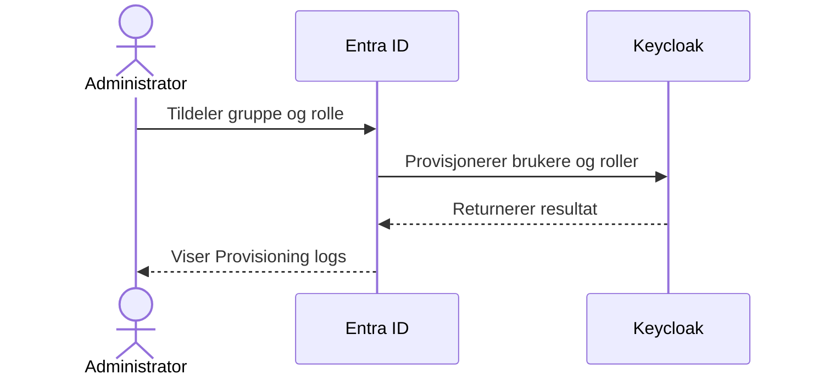

## Fjerning av tilgang

Tilgang kan fjernes ved å:

- fjerne brukeren fra en tildelt gruppe
- fjerne en rolletildeling fra gruppen
- fjerne gruppen fra federeringsapplikasjonen
- fjerne en rolle som er tildelt direkte til brukeren

Endringen behandles ved neste provisjoneringssyklus. Brukeren kan bli deaktivert i Keycloak i stedet for å bli slettet umiddelbart.

## Provisjoneringskontroll

Bruk **Provisioning logs** for å kontrollere at brukere, attributter og roller er overført til Keycloak.

1. Gå til **Enterprise applications** og åpne **federeringsapplikasjonen**.
2. Klikk **Provisioning**.
3. Åpne **Provisioning logs**.
4. Søk etter den aktuelle brukeren.
5. Kontroller at den siste handlingen er fullført uten feil.

## Feilsøking

### Innlogging

Hvis brukeren ikke får logget inn:

- Bekreft at brukeren er tildelt federeringsapplikasjonen, enten direkte eller gjennom en gruppe.
- Gruppen eller brukeren må være koblet til en applikasjonsrolle.
- Se etter feil i innloggingsloggen i Entra ID.
- Verifiser at nødvendige attributter er riktig satt på brukeren.

### Provisjonering

Hvis brukeren ikke blir provisjonert:

- Provisjonering kan ta opptil 40 minutter. Tidsintervallet styres av Microsoft.
- Brukeren må være tildelt federeringsapplikasjonen, enten direkte eller gjennom en gruppe.
- Se etter feil eller ventende hendelser i **Provisioning logs**.
- Bekreft at brukeren er aktiv i Entra ID.

### Manglende rolle

Hvis brukeren mangler en rolle:

- Verifiser at riktig rolle er tildelt brukeren eller brukerens gruppe.
- Ved gruppetildeling må brukeren være medlem av den aktuelle gruppen.
- Gruppen må være tildelt federeringsapplikasjonen.
- Se brukerens siste hendelse i **Provisioning logs** for å bekrefte at rollen ble provisjonert.
