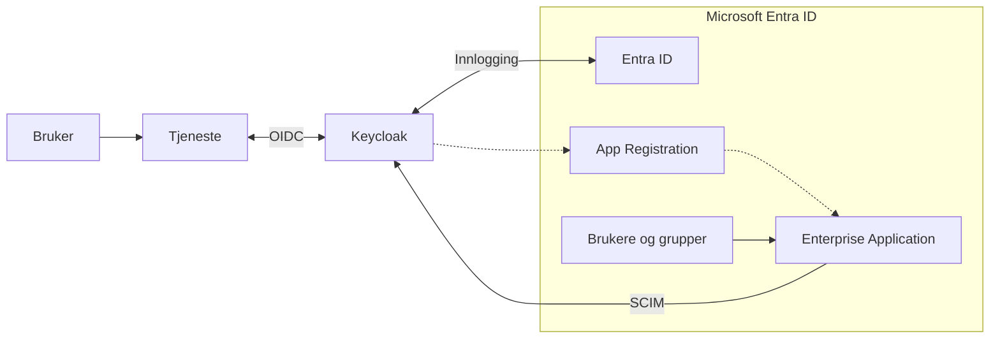
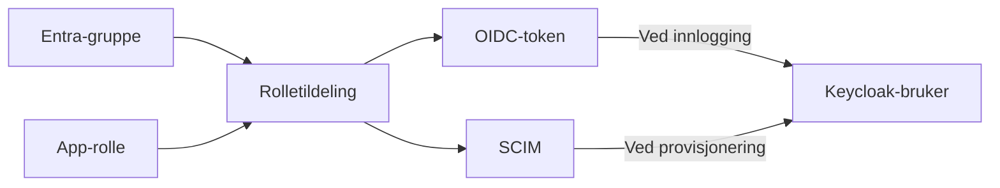
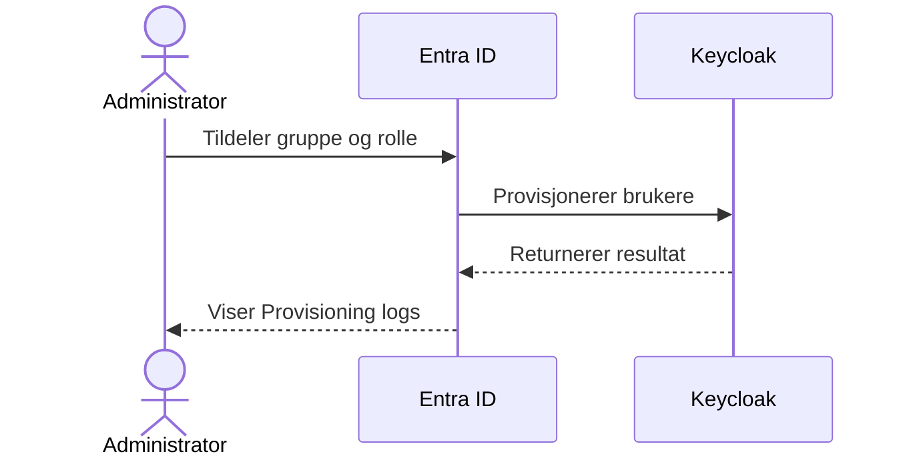

# Federering av brukere – Keycloak

Denne veiledningen beskriver hvordan federeringsløsningen mellom Microsoft Entra ID og Keycloak fungerer, og hvordan tilganger administreres.

## Terminologi

I denne veiledningen brukes betegnelsen **federeringsapplikasjonen** om Enterprise Application i Microsoft Entra ID som er koblet til Keycloak-løsningen. Applikasjonens faktiske visningsnavn i Entra ID kan variere avhengig av fylkeskommunens navnekonvensjoner.

Med **tjeneste** menes løsningen brukeren faktisk benytter, for eksempel en portal. Begrepet omfatter ikke de tekniske komponentene som ligger bak innloggingen, som Keycloak, federeringsapplikasjonen eller annen infrastruktur.

På Keycloak-siden er federeringen konfigurert i realmet med det tekniske navnet `fint`. Navnet kan forekomme i adresser, konfigurasjon, logger og feilmeldinger. Når denne veiledningen omtaler realmet `fint`, menes dette avgrensede området i Keycloak.

Det tekniske førstegangsoppsettet utføres ved hjelp av oppsettverktøyet sammen med Novari. Se [`dokumentasjon`](https://github.com/FINTLabs/flais-keycloak/blob/FLA-1868/powershell/fint/README.md) for mer informasjon.

## Arkitektur

Tjenesten kobles til Keycloak og bruker Keycloak som felles inngangspunkt for innlogging. Keycloak styrer innloggingsflyten og videresender brukeren til riktig identitetsleverandør. For fylkeskommunens brukere er Microsoft Entra ID konfigurert som en ekstern Identity Provider i Keycloak.

I Entra ID består integrasjonen av to separate, men tilknyttede objekter:

- **App Registration** inneholder den tekniske OIDC-konfigurasjonen som Keycloak bruker mot Entra ID, blant annet klient-ID, redirect URI, klienthemmelighet, tokenkonfigurasjon og definisjoner av applikasjonsroller.
- **Enterprise Application** er integrasjonens service principal i Entra ID. Den brukes til bruker- og gruppetildelinger, rolletildelinger, tilgangskontroll og SCIM-provisjonering.

Integrasjonen har to separate dataflyter:

- **Innlogging med OIDC:** Tjenesten sender brukeren til Keycloak. Keycloak bruker Entra ID som Identity Provider og videresender brukeren dit for autentisering. Etter autentisering returnerer Entra ID brukeren til Keycloak. Keycloak behandler identiteten og fullfører innloggingen mot tjenesten.
- **Provisjonering med SCIM:** Entra-provisjoneringen som er konfigurert på Enterprise Application, oppretter og oppdaterer brukere i Keycloak. Avhengig av endringen kan brukere også deaktiveres eller slettes. Nødvendige brukerattributter, blant annet ansattnummer eller studentnummer, overføres gjennom SCIM. Tildelte applikasjonsroller overføres både gjennom SCIM og ved innlogging.

> [!NOTE]
> Innlogging og SCIM-provisjonering er uavhengige prosesser. En bruker kan derfor logge inn før den første SCIM-provisjoneringen er fullført.
>
> Hvis brukeren ikke allerede finnes, oppretter Keycloak et brukerobjekt ved innlogging. Roller mappes fra OIDC-tokenet og gjøres tilgjengelige som en del av innloggingen. SCIM kompletterer senere det samme brukerobjektet med brukerattributter, blant annet ansattnummer eller studentnummer. Denne todelingen skyldes begrensninger i Microsofts implementasjon av SCIM-basert brukerprovisjonering.

## Brukerattributter

For at en bruker skal få riktig identitet i Keycloak, må nødvendige attributter være tilgjengelige i Entra ID.

Hvilke extension-attributter som benyttes, bestemmes under førstegangsoppsettet. Fylkeskommunen drifter valget og sørger for at de samme attributtene benyttes i hele flyten. Dette kan endres på et senere tidspunkt om nødvendig.

Ved innlogging sendes brukerens identitet og tildelte roller som claims i OIDC-tokenet. Attributter som ansattnummer og studentnummer overføres ikke ved innlogging, men provisjoneres gjennom SCIM.

Microsoft Entra ID er autoritativ kilde for disse brukerattributtene. Endringer skal derfor gjøres på brukeren i Entra ID, ikke direkte i Keycloak. Verdier som endres manuelt i Keycloak, kan bli overskrevet ved neste SCIM-provisjonering eller innlogging.

## Applikasjonsroller

Applikasjonsrollene defineres i App Registration. Tilgang tildeles ved å koble brukere eller grupper til rollene gjennom Enterprise Application.

Applikasjonsrollene opprettes som en del av det tekniske førstegangsoppsettet og skal følge [rollekatalogen](https://role-catalog.vigoiks.no/).

>[!IMPORTANT]
> Roller og rolleverdier skal ikke opprettes, endres eller slettes manuelt i Microsoft Entra ID. Slike endringer skal utføres ved hjelp av verktøyet fra Novari. Se [`dokumentasjon`](https://github.com/FINTLabs/flais-keycloak/blob/FLA-1868/powershell/fint/README.md) for mer informasjon.

Applikasjonsrollene overføres til Keycloak gjennom SCIM, men mappes også ved innlogging. Dette gjør at en endret rolletildeling kan tre i kraft ved brukerens neste innlogging uten å måtte vente på neste SCIM-syklus.

Denne mekanismen er viktig ved fjerning av tilganger, siden SCIM-provisjonering kan ta opptil 40 minutter. Endringen påvirker ikke nødvendigvis en allerede aktiv sesjon eller et token som allerede er utstedt.

> [!NOTE]
> Gruppene brukes til å styre hvilke brukere og roller som skal provisjoneres. Selve gruppeobjektene opprettes ikke i Keycloak.

## Ansvarsdeling

Fylkeskommunen har ansvar for autentisering av egne brukere i Microsoft Entra ID og for autorisasjonsgrunnlaget som overføres til Keycloak. Dette omfatter blant annet livssyklusen til brukerkontoene, sikkerhetskrav ved innlogging, nødvendige brukerattributter, gruppe­medlemskap og tildeling av applikasjonsroller.

Keycloak bruker informasjonen fra Entra ID til å etablere brukerens identitet og videreformidle tildelte tilganger til tjenestene. Novari har ansvar for drift og teknisk konfigurasjon av den sentrale løsningen, mens fylkeskommunen har ansvar for at identitets- og tilgangsdataene som leveres fra Entra ID, er korrekte.

## Rolletildeling

Tilgang tildeles ved å koble en Entra ID-gruppe (eller bruker direkte) til en applikasjonsrolle i federeringsapplikasjonen.

1. Logg inn i [Microsoft Azure Portal](https://portal.azure.com/) eller [Microsoft Entra administrasjonssenter](https://entra.microsoft.com/).
2. Gå til **Identity** → **Applications** → **Enterprise applications**.

   

3. Søk etter og åpne **federeringsapplikasjonen**. Bruk visningsnavnet som ble valgt under førstegangsoppsettet.
4. Klikk **Users and groups**.

   

5. Klikk **Add user/group**.

   

6. Klikk **None selected** under **Users and groups**.

   

7. Søk etter og velg gruppen som skal få tilgang.
8. Klikk **Select**.

    

9. Klikk **None selected** under **Select a role**.

    

10. Velg rollen gruppen skal ha.
11. Klikk **Select**.

    

12. Kontroller at riktig gruppe og rolle er valgt.
13. Klikk **Assign**.

    

Gruppen vises nå i oversikten **Users and groups** med den tilknyttede rollen.

En gruppe kan tildeles flere applikasjonsroller ved å opprette én tildeling per rolle. En bruker som er medlem av flere tildelte grupper, kan derfor motta flere roller.

Medlemmene av gruppen får den valgte rollen overført til Keycloak. Rollen mappes ved innlogging og overføres i tillegg gjennom SCIM-provisjoneringen.

## Fjerning av tilgang

Tilgang kan fjernes ved å:

- fjerne brukeren fra en tildelt gruppe
- fjerne en rolletildeling fra gruppen
- fjerne gruppen fra federeringsapplikasjonen
- fjerne en rolle som er tildelt direkte til brukeren

Endrede rolletildelinger blir fanget opp ved brukerens neste innlogging og overføres også ved neste provisjoneringssyklus. Dermed er ikke oppdatering av brukerens roller avhengig av at SCIM-syklusen fullføres først.

Hvis brukeren ikke lenger skal kunne logge inn, må tilgangen til federeringsapplikasjonen eller selve brukerkontoen håndteres i Entra ID. Eksisterende sesjoner eller allerede utstedte token kan fortsatt være gyldige frem til de utløper eller blir tilbakekalt.

Ved SCIM-provisjonering kan brukerobjektet i Keycloak bli deaktivert i stedet for å bli slettet umiddelbart.

## Provisjoneringskontroll

Bruk **Provisioning logs** for å kontrollere at brukere, attributter og roller er overført til Keycloak.

1. Gå til **Enterprise applications** og åpne **federeringsapplikasjonen**.
2. Klikk **Provisioning**.
3. Åpne **Provisioning logs**.
4. Søk etter den aktuelle brukeren.
5. Kontroller at den siste handlingen er fullført uten feil.

## Feilsøking

### Innlogging

Hvis brukeren ikke får logget inn:

- Bekreft at brukeren er tildelt federeringsapplikasjonen, enten direkte eller gjennom en gruppe.
- Gruppen eller brukeren må være koblet til en applikasjonsrolle.
- Se etter feil i innloggingsloggen i Entra ID.
- Verifiser at nødvendige attributter er tilgjengelige og riktig konfigurert.

### Provisjonering

Hvis brukeren ikke blir provisjonert:

- Provisjonering kan ta opptil 40 minutter. Tidsintervallet styres av Microsoft.
- Brukeren må være tildelt federeringsapplikasjonen, enten direkte eller gjennom en gruppe.
- Se etter feil eller ventende hendelser i **Provisioning logs**.
- Bekreft at brukeren er aktiv i Entra ID.

### Manglende rolle

Hvis brukeren mangler en rolle:

- Verifiser at riktig rolle er tildelt brukeren eller brukerens gruppe.
- Ved gruppetildeling må brukeren være medlem av den aktuelle gruppen.
- Gruppen må være tildelt federeringsapplikasjonen.
- Logg ut og inn igjen, slik at brukeren får et nytt OIDC-token med oppdaterte rolletildelinger.
