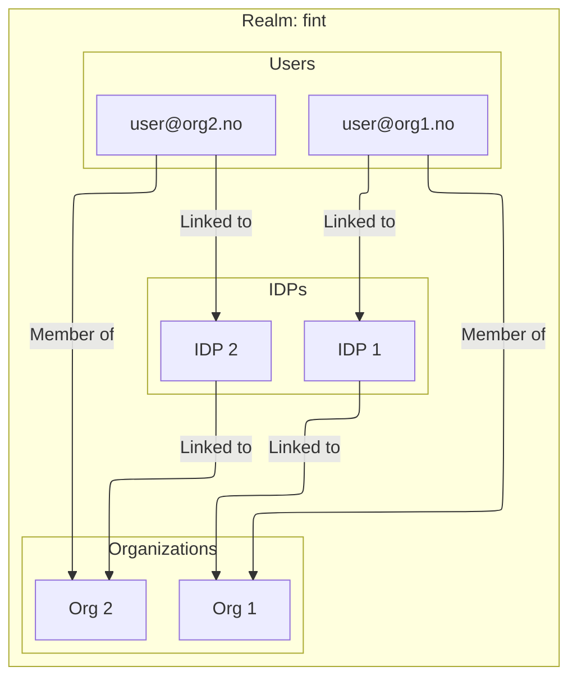

# Users

[Back: Core Concepts](README.md) · [Documentation overview](../../README.md)

## What is a user?

A user represents a single identity within a realm.

## FINT restrictions

The following restrictions describe the FINT setup; see
[FINT system constraints](../constraints/fint/constraints.md).

-   A user belongs to exactly one organization
-   User identifier must be unique within a realm
-   User can only have one domain

## Identity providers

-   A user may have linked multiple IDPs
-   All linked IDPs must belong to the user's organization

## Diagram

