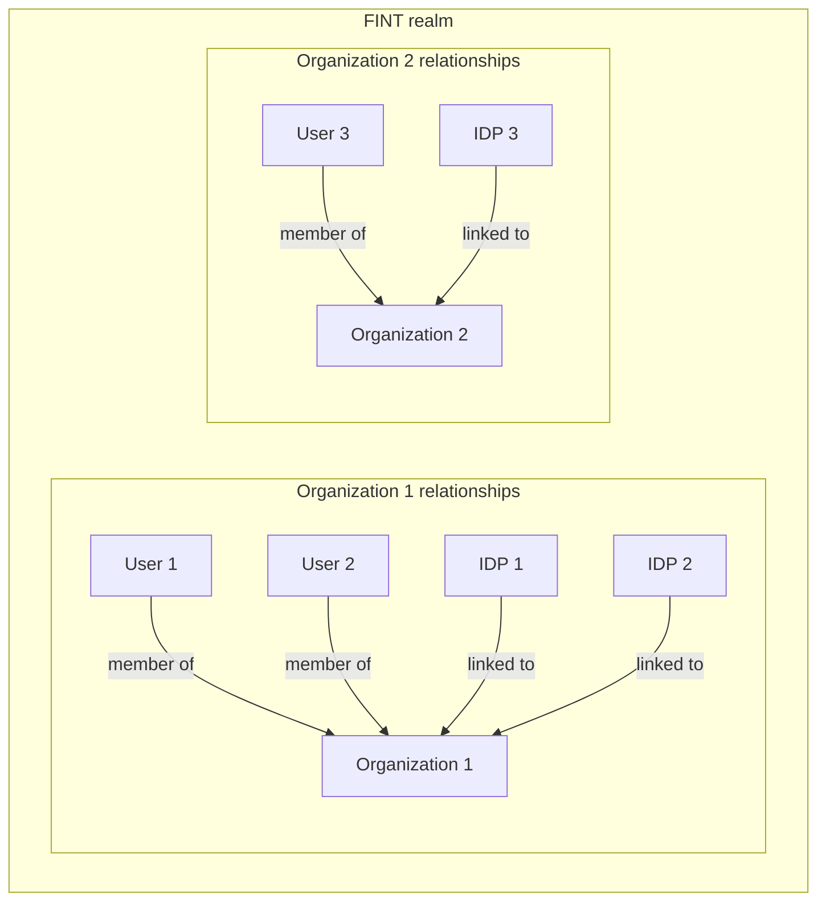

# Identity and tenant model

[Back: FINT architecture](README.md)

## Organizations and users

FINT uses organizations as tenants within the `fint` realm, rather than creating
a realm for each tenant. Users are associated with their tenant through
organization membership.

Each user belongs to exactly one organization. This is a
[FINT constraint](../constraints/constraints.md#users-and-identity-providers),
not a general Keycloak membership rule.

## Identity providers

External identity providers handle authentication. Each organization has linked
IDPs, and a user may have multiple linked external identities. The user's linked
IDPs must belong to their organization.

The diagram shows separate organization memberships and linked IDPs.

Organizations also hold tenant-specific attributes and linked domains.

## Client access

Clients can be associated with selected organizations. This association determines
which organizations a client can be used with and which users can log in through it.
FINT's custom authentication flows apply these access rules and handle
organization and identity-provider selection.
