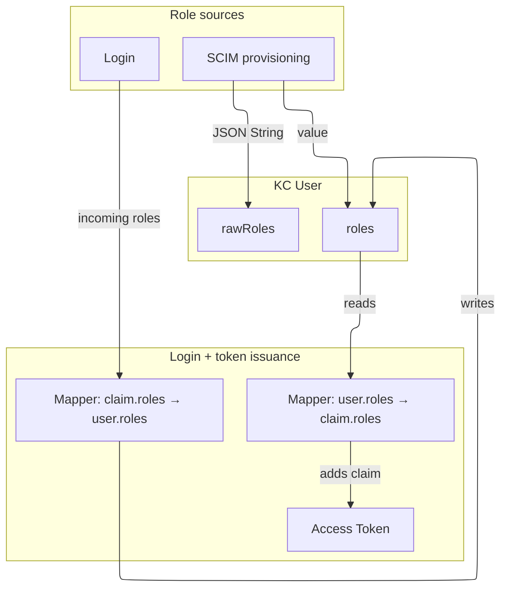

# Role updates and token issuance

[Back: Processes](README.md)

FINT receives application roles through SCIM and login token claims.

## SCIM provisioning

SCIM stores the original role payload in `rawRoles` and its role values in `roles`.
Supplied role values replace existing values. Omitted roles leave them unchanged.

## Login and token issuance

During login, the incoming `roles` claim is mapped to the user's `roles` attribute.
Outgoing token mappers read that attribute and add role claims to application tokens.

The diagram shows how both sources feed the role attributes used for token issuance.

## Diagram

