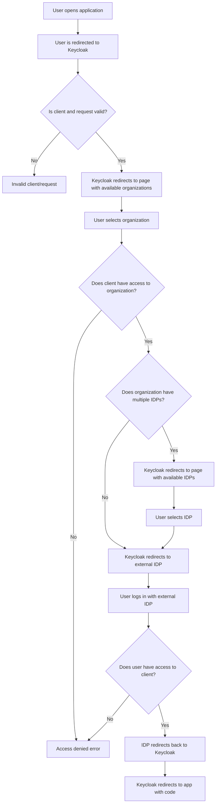

# Authentication Overview

This section describes the high-level authentication flow.

## Summary

1. User opens application
2. User is redirected to Keycloak
3. Organization is selected
4. IDP is selected
5. User authenticates with external IDP
6. Keycloak processes callback and redirects back

## Error handling

-   Invalid client or request
-   Client not allowed for organization
-   No enabled IDPs
-   User not allowed to authenticate

## Diagram

The diagram below shows the high-level authentication process
from the user opening the application to being redirected back
with an authorization code.

It focuses on _decisions_ and _error conditions_, not Keycloak internals.

