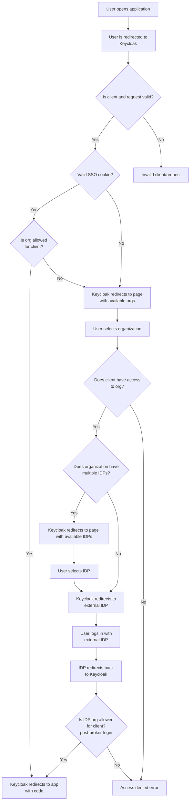

# Authentication Overview

This section describes the high-level authentication flow.

## Summary

1. User opens application
2. User is redirected to Keycloak
3. SSO cookie is checked — if valid and org is allowed, login completes immediately
4. Organization is selected
5. IDP is selected
6. Organization context is committed to the session
7. User authenticates with external IDP
8. Post-broker-login flow verifies the IDP org is allowed for the client
9. Keycloak processes callback and redirects back with a code

## Error handling

- Invalid client or request
- Client not allowed for organization (enforced at org selection and post-broker-login)
- No enabled IDPs for the selected organization
- User not allowed to authenticate via the external IDP
- Broker URL tampering — IDP used does not match the client's permitted organisations

## Diagram

The diagram below shows the high-level authentication process
from the user opening the application to being redirected back
with an authorization code.

```mermaid
flowchart TD
    is_client_and_req_valid{Is client and request valid?}
    is_sso_cookie_valid{Valid SSO cookie?}
    is_org_allowed_sso{Is org allowed<br />for client?}
    is_client_access_to_org{Does client have access<br /> to org?}
    is_org_multiple_idps{Does organization have<br /> multiple IDPs?}
    is_idp_org_allowed{Is IDP org allowed<br />for client?<br />post-broker-login}

    user_opens_app[User opens application]
    user_selects_org[User selects organization]
    user_selects_idp[User selects IDP]
    user_redirected_keycloak["User is redirected to<br /> Keycloak"]
    user_logs_in_with_ext_idp[User logs in with<br /> external IDP]

    err_access_denied[Access denied error]
    err_client_invalid[Invalid client/request]

    kc_redirects_ext_idp[Keycloak redirects to<br /> external IDP]
    kc_redirects_idp_selector[Keycloak redirects to page with available IDPs]
    kc_redirects_org_selector[Keycloak redirects to page<br /> with available orgs]
    kc_redirects_app[Keycloak redirects to app<br /> with code]

    idp_redirect_to_keycloak[IDP redirects back<br /> to Keycloak]

    user_opens_app --> user_redirected_keycloak
    user_redirected_keycloak --> is_client_and_req_valid

    is_client_and_req_valid -- Yes --> is_sso_cookie_valid
    is_client_and_req_valid -- No --> err_client_invalid

    is_sso_cookie_valid -- Yes --> is_org_allowed_sso
    is_sso_cookie_valid -- No --> kc_redirects_org_selector

    is_org_allowed_sso -- Yes --> kc_redirects_app
    is_org_allowed_sso -- No --> kc_redirects_org_selector

    kc_redirects_org_selector --> user_selects_org
    user_selects_org --> is_client_access_to_org

    is_client_access_to_org -- Yes --> is_org_multiple_idps
    is_client_access_to_org -- No --> err_access_denied
    is_org_multiple_idps -- Yes --> kc_redirects_idp_selector
    is_org_multiple_idps -- No --> kc_redirects_ext_idp

    kc_redirects_idp_selector --> user_selects_idp
    user_selects_idp --> kc_redirects_ext_idp
    kc_redirects_ext_idp --> user_logs_in_with_ext_idp

    user_logs_in_with_ext_idp --> idp_redirect_to_keycloak
    idp_redirect_to_keycloak --> is_idp_org_allowed

    is_idp_org_allowed -- Yes --> kc_redirects_app
    is_idp_org_allowed -- No --> err_access_denied
```
