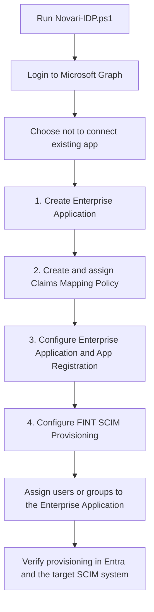
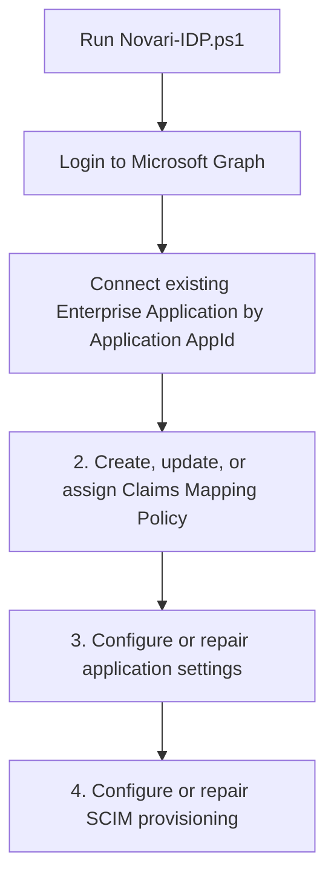

# FINT Entra ID / SCIM Setup

PowerShell tooling for creating or connecting a Microsoft Entra Enterprise Application for FINT, configuring the related App Registration and Service Principal, assigning FINT token claims, and configuring SCIM provisioning toward a FINT-compatible SCIM endpoint.

The main entrypoint is:

```powershell
pwsh ./Novari-IDP.ps1
```

## Contents

- [What this tool does](#what-this-tool-does)
- [Repository layout](#repository-layout)
- [Prerequisites](#prerequisites)
- [Required Microsoft Graph permissions](#required-microsoft-graph-permissions)
- [Quick start](#quick-start)
- [Interactive menu](#interactive-menu)
- [Typical setup flows](#typical-setup-flows)
- [Modules](#modules)
- [Helpers](#helpers)
- [SCIM provisioning details](#scim-provisioning-details)
- [Claims mapping](#claims-mapping)
- [Error handling and retry behavior](#error-handling-and-retry-behavior)
- [Troubleshooting](#troubleshooting)
- [Security notes](#security-notes)

## What this tool does

The setup process covers the Microsoft Entra ID side of a FINT identity provider and SCIM provisioning integration.

It can:

1. Create a non-gallery Enterprise Application.
2. Connect to an existing Enterprise Application by Application AppId.
3. Create or update a Claims Mapping Policy.
4. Assign the Claims Mapping Policy to the Service Principal.
5. Configure App Registration settings.
6. Configure Enterprise Application / Service Principal settings.
7. Configure SCIM provisioning toward a FINT SCIM endpoint.
8. Start or pause the provisioning job.
9. Show the active Microsoft Graph context.
10. Show the current Enterprise Application selected in the session.

## Repository layout

```text
├── Novari-IDP.ps1
├── README.md
├── helpers
│   ├── ConsoleHelpers.ps1
│   ├── EnterpriseApplicationHelpers.ps1
│   ├── GenericHelpers.ps1
│   ├── GraphContext.ps1
│   ├── GraphRetry.ps1
│   ├── Header.ps1
│   ├── Menu.ps1
│   └── RequiredScopes.ps1
└── modules
    ├── Configure-Application.ps1
    ├── Configure-ScimProvisioning.ps1
    ├── Configure-ClaimsMappingPolicy.ps1
    └── Create-EnterpriseApplication.ps1
```

## Prerequisites

Run the scripts from PowerShell with access to Microsoft Graph.

Required PowerShell modules:

```powershell
Install-Module Microsoft.Graph.Authentication -Scope CurrentUser
Install-Module Microsoft.Graph.Applications -Scope CurrentUser
```

You need a Microsoft Entra app/client that can authenticate to Microsoft Graph using client credentials:

- Tenant ID
- Client ID
- Client Secret

`Novari-IDP.ps1` prompts for these values at startup and connects with `Connect-MgGraph -ClientSecretCredential`.

## Required Microsoft Graph permissions

The scripts validate the active Graph context before each operation. The validation is intentionally strict: missing or extra permissions cause the operation to fail fast.

| Operation | Required permissions |
|---|---|
| Create Enterprise Application | `Application.ReadWrite.All`, `Policy.Read.All`, `Policy.ReadWrite.ApplicationConfiguration` |
| Create or update Claims Mapping Policy | `Application.ReadWrite.All`, `Policy.Read.All`, `Policy.ReadWrite.ApplicationConfiguration`, `Synchronization.ReadWrite.All` |
| Configure SCIM Provisioning | `Application.ReadWrite.All`, `Policy.Read.All`, `Policy.ReadWrite.ApplicationConfiguration`, `Synchronization.ReadWrite.All` |

> Note: `Configure-Application.ps1` currently uses Graph application and service principal patch calls, but it does not call `Assert-MgContextHasExactlyRequiredScopes` directly. The other modules do.

## Quick start

From the repository root:

```powershell
pwsh ./Novari-IDP.ps1
```

The interactive flow prompts for:

- Tenant ID
- Client ID
- Client Secret
- Whether to connect an existing Enterprise Application

## Typical setup flows

### New setup



### Existing setup



## Modules

### `modules/Create-EnterpriseApplication.ps1`

Creates a non-gallery Enterprise Application from the Microsoft application template.

```powershell
./modules/Create-EnterpriseApplication.ps1 -DisplayName "<display-name>"
```

Template ID used:

```text
8adf8e6e-67b2-4cf2-a259-e3dc5476c621
```

Returned JSON properties:

| Property | Description |
|---|---|
| `DisplayName` | Enterprise Application display name. |
| `ApplicationObjectId` | Object ID of the App Registration. |
| `ApplicationAppId` | Application/client ID. |
| `ServicePrincipalObjectId` | Object ID of the Enterprise Application / Service Principal. |

### `modules/Configure-ClaimsMappingPolicy.ps1`

Creates or updates a FINT Claims Mapping Policy and assigns it to the Service Principal.

```powershell
./modules/Configure-ClaimsMappingPolicy.ps1 `
  -ServicePrincipalObjectId "<service-principal-object-id>" `
  -DisplayName "<policy-display-name>" `
  -EmployeeIdSourceAttribute "extensionAttribute10" `
  -StudentNumberSourceAttribute "extensionAttribute9"
```

Behavior:

- If the Service Principal has no assigned Claims Mapping Policy, the script creates one and assigns it.
- If the Service Principal has exactly one assigned Claims Mapping Policy, the script updates that policy.
- If the Service Principal has multiple assigned Claims Mapping Policies, the script stops instead of choosing one automatically.

Created JWT claims:

| JWT claim | Source object | Default source attribute |
|---|---|---|
| `employee_id` | `user` | `extensionAttribute10` |
| `student_number` | `user` | `extensionAttribute9` |

Returned JSON properties:

| Property | Description |
|---|---|
| `ServicePrincipalObjectId` | Service Principal that received or already had the policy. |
| `ClaimsMappingPolicyObjectId` | Policy object ID. |
| `ClaimsMappingPolicyName` | Policy display name. |
| `EmployeeIdSourceAttribute` | Source attribute used for `employee_id`. |
| `StudentNumberSourceAttribute` | Source attribute used for `student_number`. |
| `WasExistingPolicyUpdated` | `true` when an existing assigned policy was updated. |

### `modules/Configure-Application.ps1`

Configures both the App Registration and the Enterprise Application / Service Principal.

```powershell
./modules/Configure-Application.ps1 `
  -ApplicationObjectId "<application-object-id>" `
  -ApplicationAppId "<application-app-id>" `
  -ServicePrincipalObjectId "<service-principal-object-id>" `
  -RedirectUri "<keycloak-redirect-uri>" `
  -AcceptMappedClaims $true
```

App Registration changes:

| Setting | Value |
|---|---|
| `api.acceptMappedClaims` | `true` by default. |
| Web redirect URI | The supplied Keycloak redirect URI. |
| Default `User` app role value | Updated to `user`. |
| Optional ID token claim | Adds `upn`. |
| Microsoft Graph delegated permissions | Adds `User.Read` and `profile`. |

Enterprise Application / Service Principal changes:

| Setting | Value |
|---|---|
| `accountEnabled` | `true` |
| `appRoleAssignmentRequired` | `true` |
| `tags` | Adds `HideApp` when missing. |
| Default `msiam_access` role | Disabled when present. |

Returned JSON properties:

| Property | Description |
|---|---|
| `ApplicationObjectId` | App Registration object ID. |
| `ApplicationAppId` | Application/client ID. |
| `ServicePrincipalObjectId` | Enterprise Application / Service Principal object ID. |
| `RedirectUri` | Configured redirect URI. |
| `AcceptMappedClaims` | Whether mapped claims are accepted. |

### `modules/Configure-ScimProvisioning.ps1`

Configures Entra provisioning toward the FINT SCIM endpoint.

```powershell
./modules/Configure-ScimProvisioning.ps1 `
  -ServicePrincipalObjectId "<service-principal-object-id>" `
  -TenantUrl "https://keycloak.example/realms/fint/scim/v2/<org-id>/" `
  -SecretToken "" `
  -ProvisionStatus On `
  -EmployeeIdSourceAttribute "extensionAttribute10" `
  -StudentNumberSourceAttribute "extensionAttribute9"
```

Behavior:

1. Validates required Graph permissions.
2. Reads available synchronization templates.
3. Selects a SCIM-looking template when possible, otherwise falls back to the first template.
4. Sets synchronization secrets.
5. Reuses an existing matching synchronization job or creates one.
6. Reads the synchronization schema.
7. Updates the target user object to the SCIM core User schema.
8. Adds the FINT target attributes.
9. Replaces the user attribute mappings.
10. Disables group mappings.
11. Starts or pauses the provisioning job based on `-ProvisionStatus`.

Returned JSON properties:

| Property | Description |
|---|---|
| `ServicePrincipalObjectId` | Enterprise Application / Service Principal object ID. |
| `SyncTemplateId` | Synchronization template used. |
| `SyncJobId` | Synchronization job used or created. |
| `TenantUrl` | SCIM tenant/base URL. |
| `ProvisionStatus` | Requested provisioning status, `On` or `Off`. |
| `TargetUserObjectName` | Target SCIM user object name. |
| `EmployeeIdSourceAttribute` | Source attribute for FINT employee ID. |
| `StudentNumberSourceAttribute` | Source attribute for FINT student number. |

## Helpers

| File | Purpose |
|---|---|
| `helpers/ConsoleHelpers.ps1` | Shared console section headings, object display, and script-result JSON parsing. |
| `helpers/EnterpriseApplicationHelpers.ps1` | Enterprise Application validation, lookup, result creation, and display helpers. |
| `helpers/GenericHelpers.ps1` | Shared prompt helpers and yes/no parsing. |
| `helpers/GraphContext.ps1` | Microsoft Graph app-only login and context display. |
| `helpers/GraphRetry.ps1` | Shared Microsoft Graph retry wrapper and detailed error reporting. |
| `helpers/Header.ps1` | Console header and logo rendering. |
| `helpers/Menu.ps1` | Interactive menu rendering and menu action dispatch. |
| `helpers/RequiredScopes.ps1` | Strict Microsoft Graph permission validation. |

## SCIM provisioning details

Synchronization secrets configured by `Configure-ScimProvisioning.ps1`:

| Key | Value |
|---|---|
| `BaseAddress` | The supplied SCIM tenant URL. |
| `SecretToken` | The supplied secret token. The interactive entrypoint currently passes an empty string. |
| `SyncAll` | `false`, meaning assigned users/groups only. |
| `SyncNotificationSettings` | Delete threshold enabled with value `500`; notifications disabled. |

Provisioning behavior:

| Area | Behavior |
|---|---|
| Template selection | Prefers a template whose ID or description indicates SCIM. Falls back to the first template. |
| Job creation | Reuses an existing matching job when possible; otherwise creates a new job. |
| Target user object | Renamed to `urn:ietf:params:scim:schemas:core:2.0:User`. |
| User flow types | `Add,Update,Delete`. |
| Groups | Group mappings are disabled. |
| Scope | Assigned users/groups only through `SyncAll=false`. |
| Accidental delete threshold | Enabled with threshold `500`. |

### SCIM target attributes

| Target attribute | Type | Required | Multivalued | Anchor |
|---|---:|---:|---:|---:|
| `id` | `String` | Yes | No | Yes |
| `active` | `Boolean` | No | No | No |
| `emails[type eq "work"].value` | `String` | No | No | No |
| `userName` | `String` | Yes | No | No |
| `externalId` | `String` | Yes | No | No |
| `roles` | `String` | No | Yes | No |
| `urn:ietf:params:scim:schemas:core:2.0:User:name.givenName` | `String` | No | No | No |
| `urn:ietf:params:scim:schemas:core:2.0:User:name.familyName` | `String` | No | No | No |
| `urn:ietf:params:scim:schemas:extension:fint:2.0:User:userPrincipalName` | `String` | No | No | No |
| `urn:ietf:params:scim:schemas:extension:fint:2.0:User:employeeId` | `String` | No | No | No |
| `urn:ietf:params:scim:schemas:extension:fint:2.0:User:studentNumber` | `String` | No | No | No |

### SCIM attribute mappings

| Source attribute / expression | Target attribute | Matching priority |
|---|---|---:|
| `objectId` | `userName` | `1` |
| Soft-delete switch expression | `active` | `0` |
| `mail` | `emails[type eq "work"].value` | `0` |
| `objectId` | `externalId` | `0` |
| App role assignments expression | `roles` | `0` |
| `givenName` | `urn:ietf:params:scim:schemas:core:2.0:User:name.givenName` | `0` |
| `surname` | `urn:ietf:params:scim:schemas:core:2.0:User:name.familyName` | `0` |
| `userPrincipalName` | `urn:ietf:params:scim:schemas:extension:fint:2.0:User:userPrincipalName` | `0` |
| `extensionAttribute10` by default | `urn:ietf:params:scim:schemas:extension:fint:2.0:User:employeeId` | `0` |
| `extensionAttribute9` by default | `urn:ietf:params:scim:schemas:extension:fint:2.0:User:studentNumber` | `0` |

## Claims mapping

The Claims Mapping Policy adds FINT-specific claims to issued tokens.

Example policy definition shape:

```json
{
  "ClaimsMappingPolicy": {
    "Version": 1,
    "IncludeBasicClaimSet": "true",
    "ClaimsSchema": [
      {
        "Source": "user",
        "ID": "extensionAttribute10",
        "JwtClaimType": "employee_id"
      },
      {
        "Source": "user",
        "ID": "extensionAttribute9",
        "JwtClaimType": "student_number"
      }
    ]
  }
}
```

## Error handling and retry behavior

Graph requests that use `Invoke-GraphWithRetry` get shared retry behavior.

| Setting | Default |
|---|---:|
| Maximum attempts | `12` |
| Initial delay | `5` seconds |
| Maximum delay | `60` seconds |

When a request with a JSON body fails, the failed request body is written to a temporary file named like:

```text
graph-failed-request-<timestamp>-<guid>.json
```

Some calls use `-NoRetryOnBadRequest`, so HTTP 400 responses fail immediately. This is used for calls where retrying a bad payload is unlikely to help.

## Troubleshooting

### Graph context has missing or extra permissions

The scripts intentionally fail when the active context does not exactly match required permissions.

Check the active context from the menu:

```text
5. Show Active Graph Context
```

Then reconnect with the expected permissions for the operation.

### Existing Enterprise Application cannot be found

When connecting an existing application, the script expects an Application AppId GUID.

It then looks up:

1. A matching Service Principal using `appId`.
2. A matching App Registration using the same `appId`.

The script fails if either lookup returns zero or multiple matches.

### Enterprise Application display name is rejected

The helper validation expects a Novari/FINT-looking Enterprise Application display name. If an existing Service Principal does not match the expected naming pattern, the script stops instead of configuring the wrong application.

### Default User app role is missing

`Configure-Application.ps1` expects a default User role and changes its value to `user`.

The script searches for a role where:

- `displayName` is `User`, or
- `value` is `User`, or
- `value` is `user`

If none is found, configuration stops.

### SCIM template list is empty

`Configure-ScimProvisioning.ps1` waits and retries while Graph prepares synchronization templates.

If templates are still empty after the retry loop, the script stops because it cannot create a provisioning job without a template.

### SCIM user object mapping cannot be found

The script searches the synchronization schema for an object mapping where:

- `sourceObjectName` is `User`
- `targetObjectName` ends with `User`

If this mapping is not found, the script warns and skips mapping updates. Inspect the schema URL shown in the warning.

### Graph returns HTTP 400 during schema or secret updates

Some calls use `-NoRetryOnBadRequest`, so HTTP 400 errors fail immediately.

Check the warning output and the temporary failed request body JSON file for the exact payload sent to Microsoft Graph.

## Security notes

- Do not commit client secrets or SCIM tokens.
- Prefer environment-specific secret handling outside the repository.
- Review the generated Claims Mapping Policy before using it in production.
- Review SCIM source attributes before enabling provisioning.
- Confirm the SCIM tenant URL points to the intended FINT tenant or organization.
