# FINT Entra ID / SCIM Setup

GitHub-ready documentation for the PowerShell tooling in this repository.

This tool creates or connects a Microsoft Entra Enterprise Application for FINT, configures the related App Registration and Service Principal, creates and assigns a Claims Mapping Policy, and configures SCIM provisioning toward a FINT-compatible SCIM endpoint.

## Contents

- [What this tool does](#what-this-tool-does)
- [Repository layout](#repository-layout)
- [Prerequisites](#prerequisites)
- [Required Microsoft Graph scopes](#required-microsoft-graph-scopes)
- [Quick start](#quick-start)
- [Interactive menu](#interactive-menu)
- [End-to-end flow](#end-to-end-flow)
- [Architecture](#architecture)
- [Operation details](#operation-details)
- [SCIM provisioning details](#scim-provisioning-details)
- [Claims mapping](#claims-mapping)
- [Error handling and retry behavior](#error-handling-and-retry-behavior)
- [Troubleshooting](#troubleshooting)

## What this tool does

The setup process covers the Entra ID side of a FINT identity provider and SCIM provisioning integration.

It can:

1. Create a non-gallery Enterprise Application.
2. Connect to an existing Enterprise Application by Application AppId.
3. Create a Claims Mapping Policy.
4. Assign the Claims Mapping Policy to a Service Principal.
5. Configure App Registration settings.
6. Configure Enterprise Application settings.
7. Configure SCIM provisioning toward a FINT SCIM endpoint.
8. Start or pause the provisioning job.

The intended entrypoint is:

```powershell
./New-Novari-IDP.ps1
```

## Repository layout

```text
.
├── New-Novari-IDP.ps1
├── Create-EnterpriseApplication.ps1
├── Create-ClaimsMappingPolicy.ps1
├── Configure-EnterpriseApplication.ps1
├── Configure-ScimProvisioning.ps1
└── helpers
    ├── GraphRetry.ps1
    ├── Header.ps1
    ├── Menu.ps1
    └── RequiredScopes.ps1
```

| File | Purpose |
|---|---|
| `New-Novari-IDP.ps1` | Interactive entrypoint. Handles Graph login, menu dispatch, and prompts. |
| `Create-EnterpriseApplication.ps1` | Instantiates a non-gallery Enterprise Application from the Microsoft application template. |
| `Create-ClaimsMappingPolicy.ps1` | Creates a FINT Claims Mapping Policy and assigns it to the Service Principal. |
| `Configure-EnterpriseApplication.ps1` | Updates App Registration and Enterprise Application settings. |
| `Configure-ScimProvisioning.ps1` | Configures synchronization secrets, job, schema, mappings, and provisioning state. |
| `helpers/GraphRetry.ps1` | Wraps Microsoft Graph calls with retry and detailed error reporting. |
| `helpers/RequiredScopes.ps1` | Validates that the active Graph context has the expected scopes. |
| `helpers/Header.ps1` | Console header and logo rendering. |
| `helpers/Menu.ps1` | Interactive menu and menu action dispatch. |

## Prerequisites

Run the scripts from PowerShell with access to Microsoft Graph.

Required PowerShell modules:

```powershell
Install-Module Microsoft.Graph.Authentication -Scope CurrentUser
Install-Module Microsoft.Graph.Applications -Scope CurrentUser
```

You need a Microsoft Entra app/client that can authenticate to Microsoft Graph using client credentials:

- Tenant ID
- Client ID
- Client Secret

The script prompts for these values when `New-Novari-IDP.ps1` starts.

## Required Microsoft Graph scopes

The scripts validate the active Graph context before performing operations.

| Operation | Required scopes |
|---|---|
| Create Enterprise Application | `Application.ReadWrite.All`, `Policy.Read.All`, `Policy.ReadWrite.ApplicationConfiguration` |
| Create Claims Mapping Policy | `Application.ReadWrite.All`, `Policy.Read.All`, `Policy.ReadWrite.ApplicationConfiguration`, `Synchronization.ReadWrite.All` |
| Configure SCIM Provisioning | `Application.ReadWrite.All`, `Policy.Read.All`, `Policy.ReadWrite.ApplicationConfiguration`, `Synchronization.ReadWrite.All` |

> Note: `RequiredScopes.ps1` checks that the Graph context has exactly the expected scopes for the operation. Missing or additional scopes cause the operation to fail fast.

## Quick start

From the repository root:

```powershell
pwsh ./New-Novari-IDP.ps1
```

You will be prompted for:

- Tenant ID
- Client ID
- Client Secret
- Whether to connect an existing Enterprise Application
- Operation-specific values such as display name, redirect URI, SCIM tenant URL, and source attributes

Default FINT attribute sources:

| Value | Default source attribute |
|---|---|
| Employee ID | `extensionAttribute10` |
| Student number | `extensionAttribute9` |

## Interactive menu

After login and optional existing app selection, the script displays a menu.

```text
1. Create Enterprise Application
2. Create and assign Claims Mapping Policy
3. Configure Enterprise Application + App Registration settings
4. Configure FINT SCIM Provisioning
5. Show Active Graph Context
6. Show Current Enterprise Application
0. Exit
```

If an existing Enterprise Application is connected during startup, option `1` is hidden for that session.

## End-to-end flow

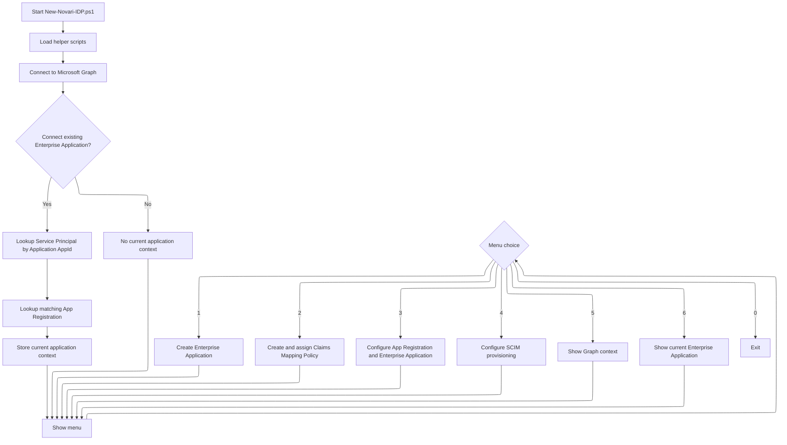

## Architecture

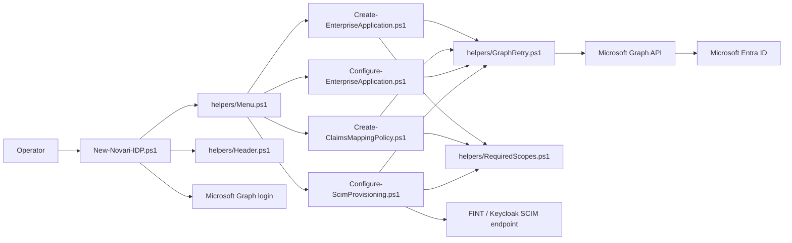

## Operation details

### 1. Create Enterprise Application

Script:

```powershell
./Create-EnterpriseApplication.ps1 -DisplayName "<display-name>"
```

This operation:

1. Validates required Graph scopes.
2. Instantiates the Microsoft non-gallery application template.
3. Returns the created App Registration and Service Principal identifiers.

Template ID used:

```text
8adf8e6e-67b2-4cf2-a259-e3dc5476c621
```

Returned values:

| Property | Description |
|---|---|
| `DisplayName` | Enterprise Application display name. |
| `ApplicationObjectId` | Object ID of the App Registration. |
| `ApplicationAppId` | Application/client ID. |
| `ServicePrincipalObjectId` | Object ID of the Enterprise Application / Service Principal. |

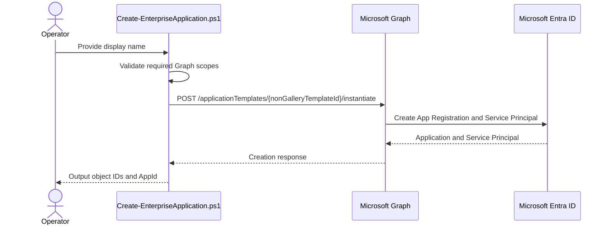

### 2. Create and assign Claims Mapping Policy

Script:

```powershell
./Create-ClaimsMappingPolicy.ps1 `
  -ServicePrincipalObjectId "<service-principal-object-id>" `
  -DisplayName "<policy-display-name>" `
  -EmployeeIdSourceAttribute "extensionAttribute10" `
  -StudentNumberSourceAttribute "extensionAttribute9"
```

This operation:

1. Validates required Graph scopes.
2. Creates a Claims Mapping Policy.
3. Maps selected source attributes into JWT claims.
4. Assigns the policy to the Service Principal.

Created JWT claims:

| JWT claim | Source object | Default source attribute |
|---|---|---|
| `employee_id` | `user` | `extensionAttribute10` |
| `student_number` | `user` | `extensionAttribute9` |

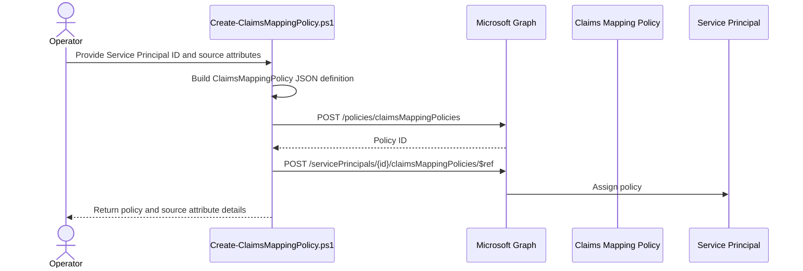

### 3. Configure Enterprise Application and App Registration

Script:

```powershell
./Configure-EnterpriseApplication.ps1 `
  -ApplicationObjectId "<application-object-id>" `
  -ApplicationAppId "<application-app-id>" `
  -ServicePrincipalObjectId "<service-principal-object-id>" `
  -RedirectUri "<keycloak-redirect-uri>" `
  -AcceptMappedClaims $true
```

This operation updates both the App Registration and Enterprise Application.

App Registration changes:

| Setting | Value |
|---|---|
| `api.acceptMappedClaims` | `true` by default |
| Web redirect URI | Prompted Keycloak redirect URI |
| App role value | Default `User` role value changed to `user` |
| Optional ID token claim | `upn` |
| Microsoft Graph delegated permissions | `User.Read`, `profile` |

Enterprise Application changes:

| Setting | Value |
|---|---|
| `accountEnabled` | `true` |
| `appRoleAssignmentRequired` | `true` |
| `tags` | Adds `HideApp` when missing |
| Default `msiam_access` role | Disabled when present |

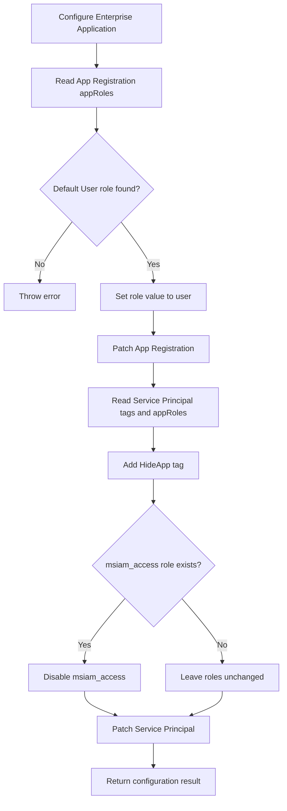

### 4. Configure SCIM provisioning

Script:

```powershell
./Configure-ScimProvisioning.ps1 `
  -ServicePrincipalObjectId "<service-principal-object-id>" `
  -TenantUrl "https://keycloak.example/realms/fint/scim/v2/<org-id>/" `
  -SecretToken "" `
  -ProvisionStatus On `
  -EmployeeIdSourceAttribute "extensionAttribute10" `
  -StudentNumberSourceAttribute "extensionAttribute9"
```

This operation:

1. Validates required Graph scopes.
2. Locates a SCIM synchronization template.
3. Sets synchronization secrets.
4. Reuses or creates a synchronization job.
5. Reads the synchronization schema.
6. Updates the target user object to the SCIM core User schema.
7. Adds FINT target attributes.
8. Replaces user attribute mappings.
9. Disables group mappings.
10. Starts or pauses the provisioning job.

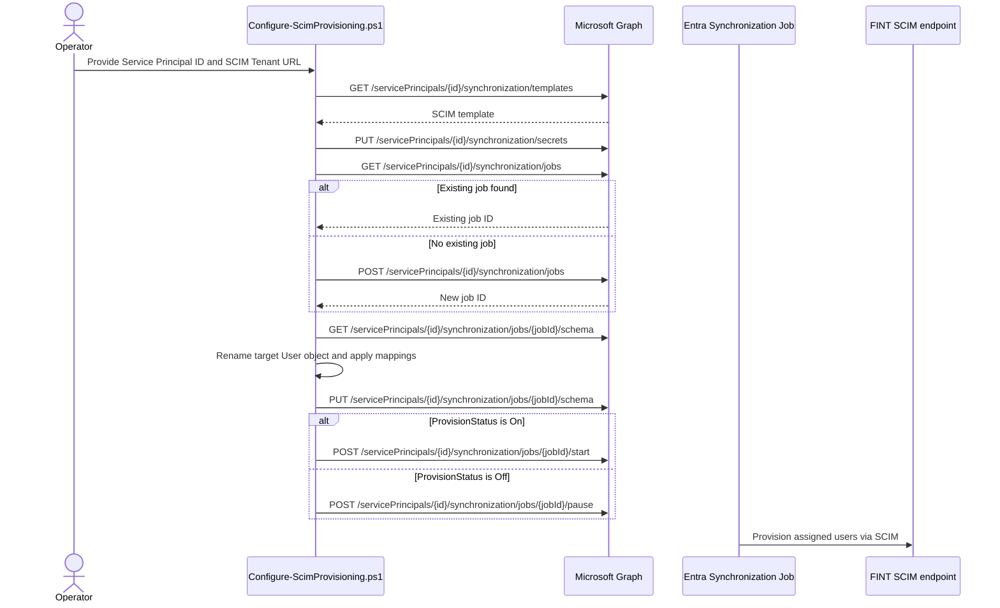

## SCIM provisioning details

Synchronization secrets configured by the script:

| Key | Value |
|---|---|
| `BaseAddress` | The supplied SCIM tenant URL. |
| `SecretToken` | The supplied secret token. The interactive entrypoint currently passes an empty string. |
| `SyncAll` | `false`, meaning assigned users/groups only. |
| `SyncNotificationSettings` | Delete threshold enabled with value `500`; notifications disabled. |

Provisioning behavior:

| Area | Behavior |
|---|---|
| Template selection | Prefers a template whose ID or description indicates SCIM. Falls back to first template. |
| Job creation | Reuses existing matching job when possible; otherwise creates a new job. |
| Target user object | Renamed to `urn:ietf:params:scim:schemas:core:2.0:User`. |
| User flow types | `Add,Update,Delete`. |
| Groups | Group mappings are disabled. |
| Scope | Assigned users/groups only through `SyncAll=false`. |
| Accidental delete threshold | Enabled with threshold `500`. |

### SCIM target attributes

The SCIM schema is updated with these target attributes:

| Target attribute | Type | Required | Multivalued | Anchor |
|---|---:|---:|---:|---:|
| `id` | `String` | Yes | No | Yes |
| `active` | `Boolean` | No | No | No |
| `emails[type eq "work"].value` | `String` | No | No | No |
| `userName` | `String` | Yes | No | No |
| `externalId` | `String` | Yes | No | No |
| `roles` | `String` | No | Yes | No |
| `urn:ietf:params:scim:schemas:core:2.0:User:name.givenName` | `String` | No | No | No |
| `urn:ietf:params:scim:schemas:core:2.0:User:name.familyName` | `String` | No | No | No |
| `urn:ietf:params:scim:schemas:extension:fint:2.0:User:userPrincipalName` | `String` | No | No | No |
| `urn:ietf:params:scim:schemas:extension:fint:2.0:User:employeeId` | `String` | No | No | No |
| `urn:ietf:params:scim:schemas:extension:fint:2.0:User:studentNumber` | `String` | No | No | No |

### SCIM attribute mappings

| Source attribute / expression | Target attribute | Matching priority |
|---|---|---:|
| `objectId` | `userName` | `1` |
| Soft-delete switch expression | `active` | `0` |
| `mail` | `emails[type eq "work"].value` | `0` |
| `objectId` | `externalId` | `0` |
| App role assignments expression | `roles` | `0` |
| `givenName` | `urn:ietf:params:scim:schemas:core:2.0:User:name.givenName` | `0` |
| `surname` | `urn:ietf:params:scim:schemas:core:2.0:User:name.familyName` | `0` |
| `userPrincipalName` | `urn:ietf:params:scim:schemas:extension:fint:2.0:User:userPrincipalName` | `0` |
| `extensionAttribute10` by default | `urn:ietf:params:scim:schemas:extension:fint:2.0:User:employeeId` | `0` |
| `extensionAttribute9` by default | `urn:ietf:params:scim:schemas:extension:fint:2.0:User:studentNumber` | `0` |

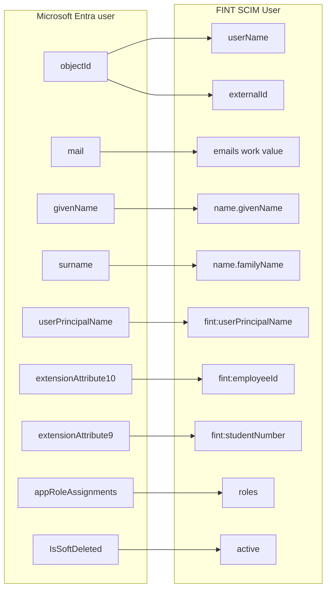

## Claims mapping

The Claims Mapping Policy adds FINT-specific claims to issued tokens.

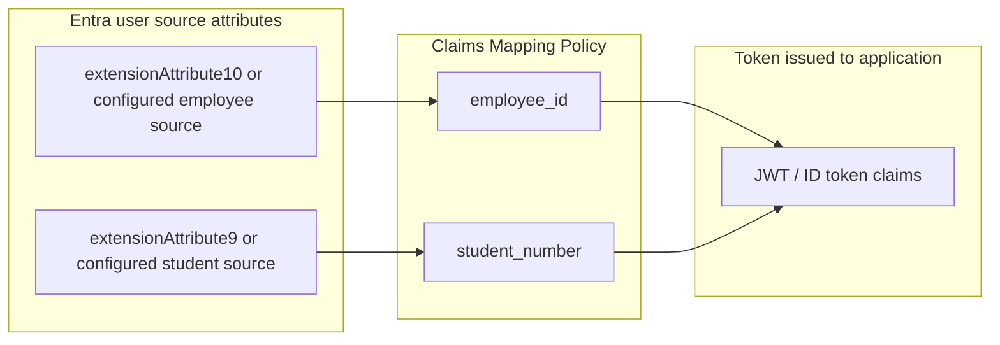

Example policy definition shape:

```json
{
  "ClaimsMappingPolicy": {
    "Version": 1,
    "IncludeBasicClaimSet": "true",
    "ClaimsSchema": [
      {
        "Source": "user",
        "ID": "extensionAttribute10",
        "JwtClaimType": "employee_id"
      },
      {
        "Source": "user",
        "ID": "extensionAttribute9",
        "JwtClaimType": "student_number"
      }
    ]
  }
}
```

## Error handling and retry behavior

All Graph operations that use `Invoke-GraphWithRetry` get shared retry behavior.

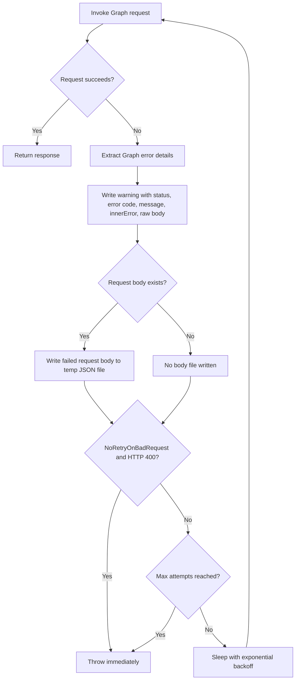

Retry defaults:

| Setting | Default |
|---|---:|
| Maximum attempts | `12` |
| Initial delay | `5` seconds |
| Maximum delay | `60` seconds |

When a request with a JSON body fails, the body is written to a temporary file named like:

```text
graph-failed-request-<timestamp>-<guid>.json
```

This helps debug schema and provisioning payload issues.

## Troubleshooting

### Graph context has missing or extra scopes

The scripts intentionally fail when the active context does not exactly match required scopes.

Check the active context from the menu:

```text
5. Show Active Graph Context
```

Then reconnect using the expected permissions for the operation.

### Existing Enterprise Application cannot be found

When connecting an existing application, the script expects an Application AppId GUID.

It then looks up:

1. A matching Service Principal using `appId`.
2. A matching App Registration using the same `appId`.

The script fails if either lookup returns zero or multiple matches.

### Default User app role is missing

`Configure-EnterpriseApplication.ps1` expects a default User role and changes its value to `user`.

The script searches for a role where:

- `displayName` is `User`, or
- `value` is `User`, or
- `value` is `user`

If none is found, configuration stops.

### SCIM template list is empty

`Configure-ScimProvisioning.ps1` waits and retries while Graph prepares synchronization templates.

If templates are still empty after the retry loop, the script stops because it cannot create a provisioning job without a template.

### SCIM user object mapping cannot be found

The script searches the synchronization schema for an object mapping where:

- `sourceObjectName` is `User`
- `targetObjectName` ends with `User`

If this mapping is not found, the script warns and skips mapping updates. Inspect the schema URL shown in the warning.

### Graph returns HTTP 400 during schema or secret updates

Some calls use `-NoRetryOnBadRequest`, so HTTP 400 errors fail immediately.

Check the warning output and the temporary failed request body JSON file for the exact payload sent to Microsoft Graph.

## Security notes

- Do not commit client secrets or SCIM tokens.
- Prefer environment-specific secret handling outside the repository.
- Review the generated Claims Mapping Policy before using it in production.
- Review SCIM source attributes before enabling provisioning.
- Confirm the SCIM tenant URL points to the intended FINT tenant/organization.

## Suggested run order

For a new setup:

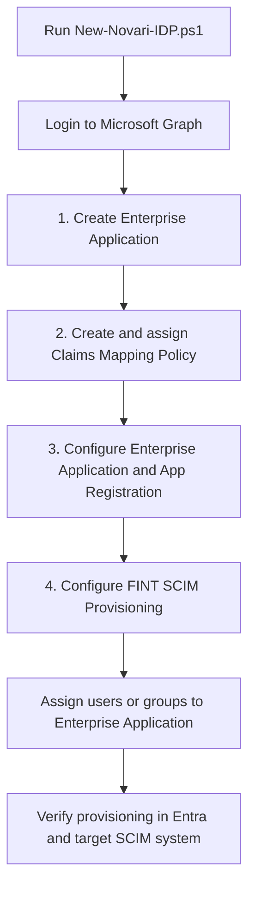

For an existing setup:

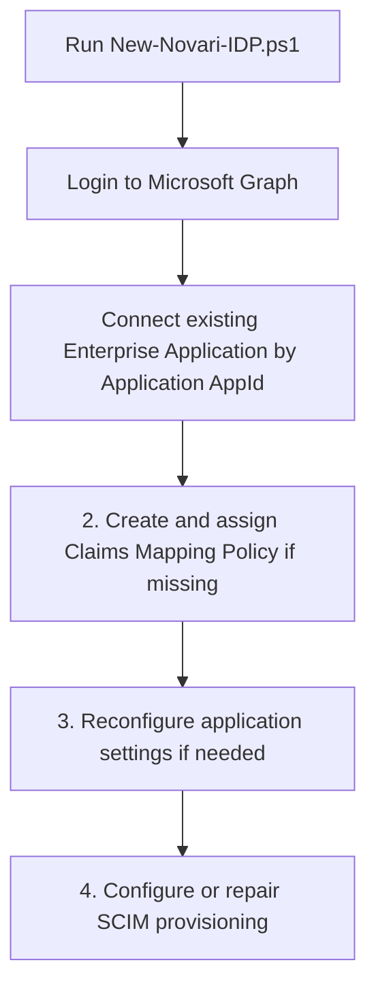
